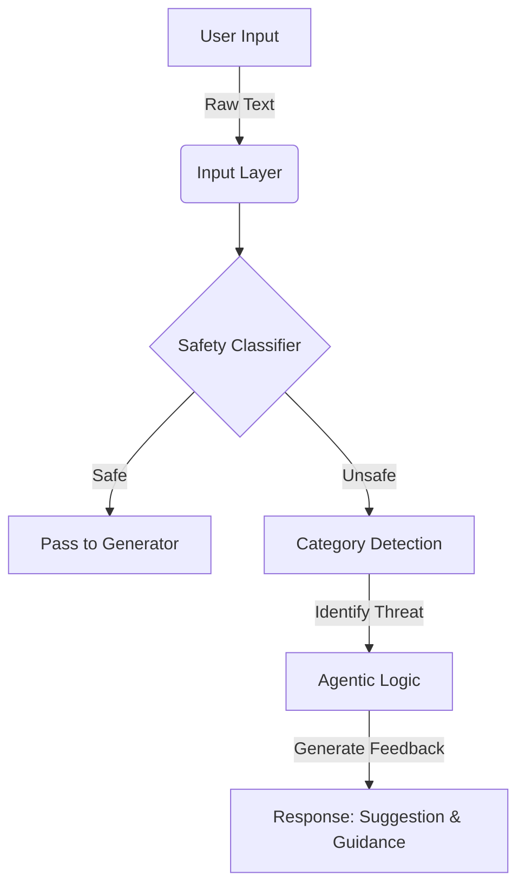

# 🛡️ SafeSpace: Agentic AI Content Moderator

> **An intelligent, context-aware API designed to ensure safe and educational interactions between children and Generative AI tools.**


## 📖 Overview

As Generative AI becomes central to children's entertainment, standard "Block/Allow" filters are no longer sufficient. **SafeSpace** is an **Agentic AI Middleware** designed to sit between a child's prompt and a Generative AI model.

Instead of simply rejecting unsafe inputs, SafeSpace acts as an **educational coach**, providing constructive suggestions to guide children toward positive storytelling.

---

## 🧠 Project Architecture

This system follows a pipeline approach to process, analyze, and respond to user inputs in real-time.



### **Flow Breakdown**

1. **Input Layer:** Receives raw text from the user (via FastAPI).
2. **Vectorization:** Converts text to numerical format using TF-IDF.
3. **Classification Engine:**
* **Model A (Safety):** Binary classifier (Safe vs. Unsafe).
* **Model B (Context):** Multi-class classifier (Violence, Scary Themes, Bullying).


4. **Agentic Logic:** Maps the identified category to a repository of child-psychology-aligned suggestions.
5. **Output:** Returns a JSON object with a verdict, confidence score, and educational guidance.

---

## 🔌 API Usage (The "Code" Part)

You can test the API using the interactive Swagger UI at `http://127.0.0.1:8000/docs`.

### **1. Example Request**

*Send this JSON to the `/analyze` endpoint:*

```json
POST /analyze
{
  "text": "The monster punched the villager in the face."
}

```

### **2. Example Response**

*The API returns this structured analysis:*

```json
{
  "text": "The monster punched the villager in the face.",
  "is_safe": false,
  "confidence_score": 0.89,
  "flagged_category": "Violence",
  "message": "Hold on! This looks a bit too violent. How can they solve this without fighting?",
  "agent_suggestion": "Try using words like 'helped' or 'rescued' instead."
}

```

---

## 🛠️ Technical Implementation

### **Installation & Setup**

**1. Clone the Repository**

```bash
git clone [https://github.com/yourusername/project-safespace.git](https://github.com/yourusername/project-safespace.git)
cd project-safespace

```

**2. Install Dependencies**

```bash
pip install fastapi uvicorn scikit-learn pandas

```

**3. Train the Model**
The system uses a custom dataset to train the classification engine.

```bash
python train_model.py

```

*Output: "Models trained and saved successfully!"*

**4. Run the API Server**

```bash
uvicorn main:app --reload

```

---

## 🔮 Future Improvements

* **Transformer Integration:** Upgrade the classification backend to use BERT/DistilBERT for deeper contextual understanding.
* **LLM-Based Suggestions:** Replace rule-based suggestions with a small LLM to generate dynamic, story-specific rewrites.
* **Feedback Loop:** Implement a mechanism to log user corrections to improve the model over time.

---

## 👨‍💻 Author

**Aniket Shah**
*AI & Machine Learning Engineer*
